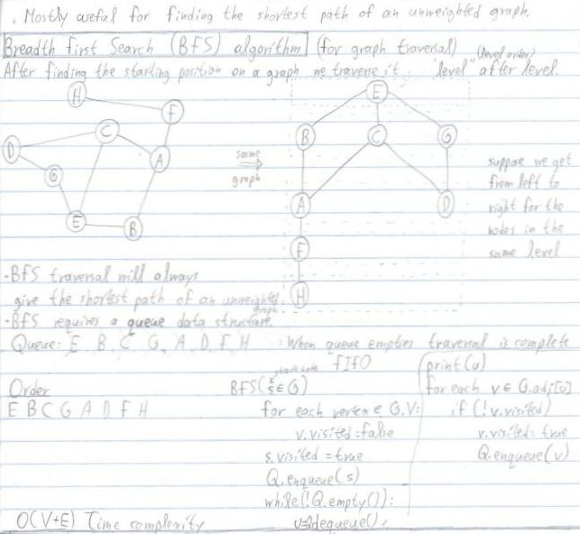

<h1 align="center">
	<a href="https://github.com/KeyC0de/MazeSolving">Maze Solving</a>
</h1>
<hr>

A maze is a programming puzzle involving a collection of paths. And the programmer must construct an algorithm that will traverse a path starting from a specified location and ending to a goal location.

A Maze is typically given as N*N array, eg. maze[N][N]. Imagine you're a rat trapped in the maze and you have to traverse the blocks to go from the Start to the Destination block. Reaching the destination blocks allows you to escape the maze and go free!

The rat only possesses elementary movement abilities, either left/right or up/down. It's a 2d world for the rat and it suits us nicely.

You can provide whatever maze you want as input to this program. Use a file place it somewhere inside the project and run the program by specifying the name of the maze as input (in Visual Studio you can do that in Project Properties -> Debugging -> Command arguments -> write say "maze.txt" without the quotes).

To create your own mazes to supply to it here's how my mazes are identified, so you will use the same ascii characters. There's no restriction to the size of the maze, but obviously the larger it is the slower it will be.

`#` indicate obstacles (the rat can't cross those)
`.` : empty space (the rat can roam free)
`S` : starting position
`G` : ending (Goal) position
`=` : path followed

So giving the maze "maze1.txt" below as input:</br>

```
S#####
......
#.#.#.
#.#.#.
...#.G
##...#
```

Would output this:

```
S#####
======
#.#.#=
#.#.#=
...#.G
##...#
```

where `=` are parts of the resulting path that was taken.


## Algorithm

And now a little bit about the algorithm used to solve the maze. I use the Breadth First Search algorithm to traverse the maze, which requires a Queue data structure. BFS is not the best choice but it is a sensible choice. BFS will always find the shortest path to the destination, if one exists. 

I provide my own implementation for a quickly put-together handicapped C-like queue (but you can change that to `std::queue` if you want).

1. construct a 2d array (vector) to store the maze
2. initialize the Queue
3. read the maze from the file character-per-character and place them to the 2d vector. At the same time when you get to the `S` block place it to the queue (enqueue it).
4. close the file when done reading
5. start removing a `Node` (element) from the `Queue` and check if it is the `S` node - we want to start from the start!
6. investigate possible places to go left/right or up/down. If we can go then enqueue the next position and start all over.

I know this isn't the best explanation, but be sure to check the link down below by Robert I. Pitts timeless article on the topic; it's succinct and he nails it. For more on BFS and path finding check out my personal notes of it:

<p style="text-align: center;">
	
</p>

For the C++ implementation I used Windows 8.1 x86_64, Visual Studio 2017, Modern C++17 to build the project. It should work on other platforms as well.

For completion I have also provided the same program written in C. It is located inside the `c` folder and there's a makefile to build it cross platform (provided you have make - for windows get [MINGW](https://osdn.net/projects/mingw/releases/)). Just go there and type `make`.


# Contribute

Please submit any bugs you find through GitHub repository 'Issues' page with details describing how to replicate the problem. If you liked it or you learned something new give it a star, clone it, laugh at it, contribute to it whatever. I appreciate all of it. Enjoy.


# License

Distributed under the GNU GPL V3 License. See "GNU GPL license.txt" for more information.


# Contact

email: *nik.lazkey@gmail.com*</br>
website: *www.keyc0de.net*


# Acknowledgements

Recursion: Solving a Maze [link](https://www.cs.bu.edu/teaching/alg/maze/) by Robert I. Pitts
